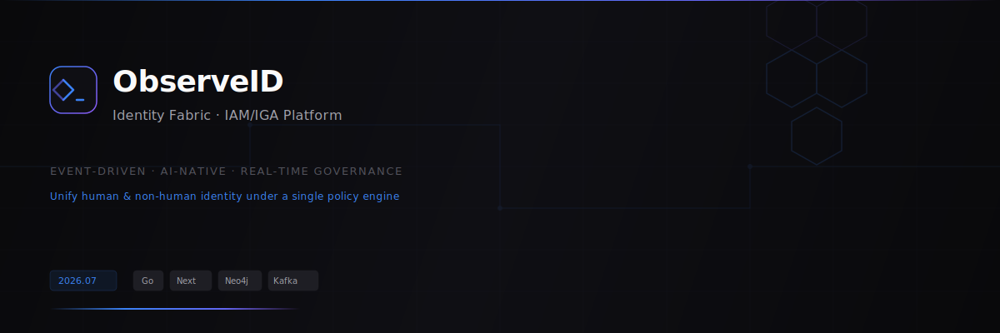

<picture>
  <source media="(prefers-color-scheme: dark)" srcset="media/banner.svg">
  
</picture>

<br/>

<div align="center">

[](https://go.dev)
[](https://nextjs.org)
[](https://postgresql.org)
[](https://neo4j.com)
[](https://temporal.io)
[](https://kafka.apache.org)
[](https://cedarpolicy.com)

[](https://github.com/ShoaibsProjects/observeid/actions/workflows/ci.yml)
[](https://github.com/ShoaibsProjects/observeid/actions/workflows/deploy.yml)
[]()
[]()

<br/>

---

### Event-Driven · AI-Native · Real-Time Governance

**Unify human and non-human identity under a single policy engine, graph database, and durable workflow system.**

---

<br/>
</div>

## ⎯ Overview

ObserveID is a next-generation IAM/IGA platform architected for the 2026 security landscape. It treats every workload, agent, API key, and human as a first-class identity — governed by Cedar policies, tracked in Neo4j, secured with CAEP, and orchestrated via Temporal workflows.

<pre align="center">
  ⚡ SCIM Provisioning  ·  🔐 RBAC/ABAC/ReBAC  ·  🤖 AI Agent Security
  📊 Real-Time Audit    ·  🔄 Event-Driven Sync ·  🧠 GraphRAG Copilot
</pre>

## ⎯ Architecture

```
┌──────────────────────────────────────────────────────────────────────┐
│                          OBSERVEID PLATFORM                           │
├──────────────────────────────────────────────────────────────────────┤
│  ┌──────────┐  ┌──────────┐  ┌──────────┐  ┌──────────┐ ┌────────┐ │
│  │ Identity │  │  Access  │  │ Policy   │  │AI Copilot│ │ CAEP   │ │
│  │ Service  │  │ Service  │  │ Engine   │  │(GraphRAG)│ │ Stream │ │
│  │ (SCIM)   │  │(RBAC/    │  │ (Cedar)  │  │          │ │        │ │
│  │          │  │ ABAC)    │  │          │  │          │ │        │ │
│  └────┬─────┘  └────┬─────┘  └────┬─────┘  └────┬─────┘ └───┬────┘ │
│       │             │             │             │           │       │
│  ┌────┴─────────────┴─────────────┴─────────────┴───────────┴────┐ │
│  │                  Event Bus · Kafka/Redpanda                     │ │
│  └────────────────────────────────────────────────────────────────┘ │
│       │             │             │             │           │       │
│  ┌────┴─────────────┴─────────────┴─────────────┴───────────┴────┐ │
│  │              Temporal Workflow Engine (Durable Exec)            │ │
│  │  Namespaces: offboarding · provisioning · reconciliation ·     │ │
│  │              analysis · agent_monitoring                       │ │
│  └────────────────────────────────────────────────────────────────┘ │
│       │             │             │             │           │       │
│  ┌────┴─────────────┴─────────────┴─────────────┴───────────┴────┐ │
│  │         Data: PostgreSQL · Neo4j · Qdrant · Redis · QLDB       │ │
│  └────────────────────────────────────────────────────────────────┘ │
│       │             │             │             │           │       │
│  ┌────┴─────────────┴─────────────┴─────────────┴───────────┴────┐ │
│  │       Security: SPIFFE/SPIRE · FIDO2 · PQC · mTLS · Vault     │ │
│  └────────────────────────────────────────────────────────────────┘ │
└──────────────────────────────────────────────────────────────────────┘
```

## ⎯ Key Features

| Area | Capability | Status |
|------|-----------|--------|
| **Identity Engine** | SCIM 2.0 CRUD, bulk import, soft-delete, PG+Neo4j dual-write | ✅ |
| **Connector Framework** | Entra ID (delta sync), LDAP/AD, SCIM — schema discovery, health monitoring | ✅ |
| **Policy Engine** | Cedar ABAC/RBAC/ReBAC with CI validation | ✅ |
| **Temporal Workflows** | Onboard · Offboard (fan-out) · Grant · Revoke · JIT · SoD · Anomaly | ✅ |
| **AI Copilot** | GraphRAG over Neo4j — natural language identity queries | ✅ |
| **CAEP Stream** | Real-time session revocation broadcast | ✅ |
| **Credential Vault** | AES-256-GCM encrypted local vault with UI | ✅ |
| **Audit Logs** | Immutable trail with detail viewer UI | ✅ |
| **Connector UI** | Stats bar, expandable Accounts/Schema tabs, health indicators, delta sync | ✅ |
| **Design System** | 11 shared UI components, dark industrial theme, electric blue accent | ✅ |

## ⎯ Tech Stack

```
┌─ Languages ─────────────────────────────────────────────────────┐
│  Go 1.23  ·  TypeScript  ·  Cedar Policy                       │
├─ Backend ───────────────────────────────────────────────────────┤
│  net/http (chi)  ·  Temporal SDK  ·  Neo4j Driver  ·  pgx      │
│  Kafka (franz-go)  ·  Cedar Go Bindings  ·  OpenTelemetry      │
├─ Frontend ──────────────────────────────────────────────────────┤
│  Next.js 14 (static)  ·  TailwindCSS  ·  Plus Jakarta Sans     │
│  JetBrains Mono  ·  Framer Motion-ready CSS tokens             │
├─ Data ──────────────────────────────────────────────────────────┤
│  PostgreSQL 16  ·  Neo4j 5  ·  Qdrant  ·  Redis 7             │
├─ Orchestration ─────────────────────────────────────────────────┤
│  Temporal 1.22  ·  Kafka + Schema Registry  ·  Zookeeper       │
├─ Security ──────────────────────────────────────────────────────┤
│  Cedar Policies  ·  AES-256-GCM Vault  ·  SPIFFE/SPIRE         │
│  mTLS  ·  CAEP  ·  FIDO2  ·  Post-Quantum Crypto               │
├─ Observability ─────────────────────────────────────────────────┤
│  OpenTelemetry  ·  Grafana  ·  Prometheus  ·  Structured Audit │
└─────────────────────────────────────────────────────────────────┘
```

## ⎯ Quick Start

```bash
# Start infrastructure (11 containers: PG, Neo4j, Kafka, Temporal, etc.)
make up

# Run DB migrations and seed data
make dev-db

# Build and run backend (serves API + frontend on :8080)
make dev-backend

# Or in separate terminals:
make backend     # Go backend
make frontend    # Next.js static export
```

> **Demo URL:** [http://localhost:8080](http://localhost:8080)

## ⎯ Workflows

| Workflow | Description | Priority |
|----------|-------------|----------|
| `OffboardIdentityWorkflow` | Complete offboarding with parallel fan-out, CAEP broadcast, cascade agent revocation | 🔴 Critical |
| `OnboardIdentityWorkflow` | Identity creation with role assignment and optional approval gates | 🟠 High |
| `GrantAccessWorkflow` | Access provisioning with approval workflow and JIT auto-expiry | 🟠 High |
| `RevokeAccessWorkflow` | Emergency access revocation with cache invalidation | 🔴 Critical |
| `JustInTimeAccessWorkflow` | Time-bounded access with automatic expiration | 🟡 Medium |
| `AgentAnomalyDetectionWorkflow` | Cron-based AI agent behavioral analysis | 🟡 Medium |
| `DetectSoDViolationsWorkflow` | Hourly SoD violation scanning via Neo4j graph traversal | 🟡 Medium |

## ⎯ API Endpoints

```
SCIM 2.0
  GET    /scim/v2/Users            List users
  POST   /scim/v2/Users            Create user
  GET    /scim/v2/Users/{id}       Get user
  DELETE /scim/v2/Users/{id}       Delete user (triggers offboarding)

Identity API
  GET    /api/v1/identities        List identities
  POST   /api/v1/identities        Create identity (PG + Neo4j)
  POST   /api/v1/identities/bulk   Bulk import with upsert
  DELETE /api/v1/identities/{id}   Soft-delete termination
  GET    /api/v1/identities/{id}/entitlements   Access paths
  GET    /api/v1/identities/{id}/blast-radius   Blast radius

Connector API
  GET    /api/v1/connectors        List connectors
  POST   /api/v1/connectors        Register connector
  POST   /api/v1/connectors/{id}/connect      Connect
  POST   /api/v1/connectors/{id}/sync         Full sync
  POST   /api/v1/connectors/{id}/sync-delta   Delta sync
  GET    /api/v1/connectors/{id}/schema       Schema discovery
  GET    /api/v1/connectors/{id}/health       Health monitoring
  GET    /api/v1/connectors/{id}/identities   Synced identities

Vault
  GET    /api/v1/vault             List secrets
  POST   /api/v1/vault             Store secret (AES-256-GCM)

Audit
  GET    /api/v1/audit             Recent audit events
  GET    /api/v1/audit/{id}        Audit detail

Agent / NHI
  GET    /api/v1/agents            List agents
  POST   /api/v1/agents            Register agent
  POST   /api/v1/agents/{id}/kill-switch   Emergency kill

AI Copilot
  POST   /api/v1/copilot/query     Natural language identity query

CAEP
  POST   /api/v1/caep/broadcast    Broadcast session-revoked event
```

## ⎯ Project Structure

```
observeid/
├── proto/                    # Protobuf definitions
│   ├── event/v1/             # Identity events
│   └── model/v1/             # Data models
├── backend/
│   ├── cmd/identity-service/ # Entry point
│   └── internal/
│       ├── domain/           # Core domain types
│       ├── connector/        # IGA connector framework
│       ├── workflow/         # Temporal workflows
│       ├── activities/       # Temporal activities
│       ├── service/          # HTTP service layer
│       ├── vault/            # AES-256-GCM encrypted vault
│       ├── audit/            # Immutable audit logging
│       ├── graph/            # Neo4j query patterns
│       └── ai/               # GraphRAG copilot
├── frontend/
│   ├── src/app/              # Dashboard, Identities, Connectors, etc.
│   └── src/components/ui/    # 11-shared design system
├── policies/                 # Cedar policies
│   ├── identity.cedarschema  # Policy schema
│   ├── rbac.cedar            # Role-based access control
│   ├── abac.cedar            # Attribute-based access control
│   ├── agent.cedar           # AI agent policies
│   └── sod_emergency.cedar   # SoD & emergency access
├── infrastructure/           # Docker Compose + DB init
├── deploy/k8s/               # Kubernetes manifests
└── docker/                   # Dockerfiles
```

## ⎯ Cedar Policies

```cedar
// RBAC: Administrators have full access
permit(
    principal in Role::"Administrator",
    action,
    resource
);

// ABAC: Contractors cannot access PII
forbid(
    principal in Role::"Contractor",
    action,
    resource
) when {
    resource.data_classification in ["pii", "phi", "pci"]
};

// Agent: Kill switch — deny all for revoked agents
forbid(
    principal is Agent,
    action,
    resource
) when {
    principal.is_revoked == true
};
```

## ⎯ License

```
MIT License — ObserveID, Inc.
Copyright © 2026 ObserveID
```
